# How to run Stable Diffusion WebUI on SageMaker Notebook

Hello everyone, today we are going to create a simple WebUI on SageMaker to run Stable Diffusion Models by using  [AUTOMATIC1111](https://github.com/AUTOMATIC1111/stable-diffusion-webui) package.

## Step 1. Open SageMaker Notebook Instance:

Navigate to the SageMaker console (https://console.aws.amazon.com/sagemaker/).
- Click on "Notebook instances" in the left sidebar.
- Create a Notebook Instance
  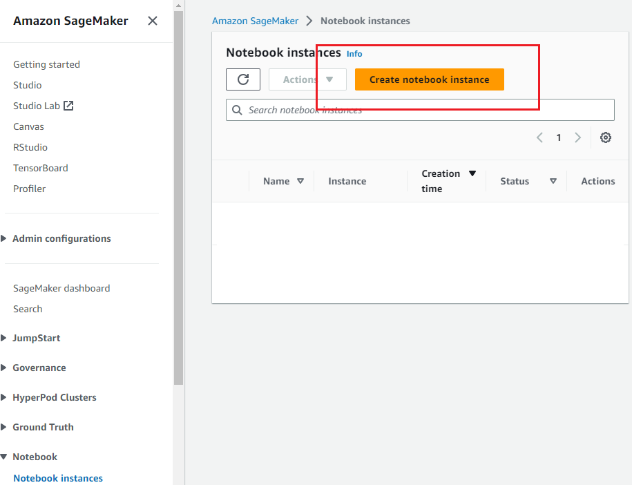
- Give Your Notebook Instance a name ,for example `automatic-sagemaker` and suitable instance type `ml.g4dn.xlarge` and instance volume `50gb` and give an iam role after that create the instance
  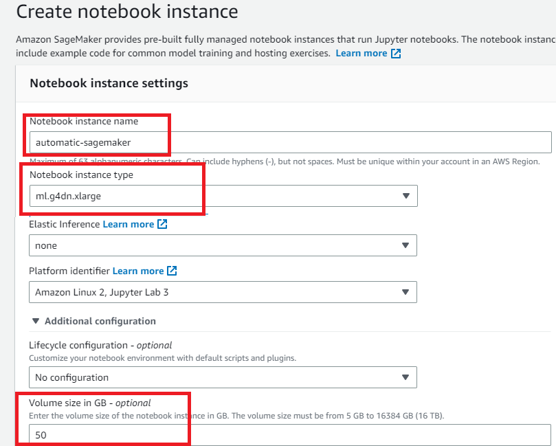
- When the status of the notebook is `InService`, choose Open JupyterLab.
- 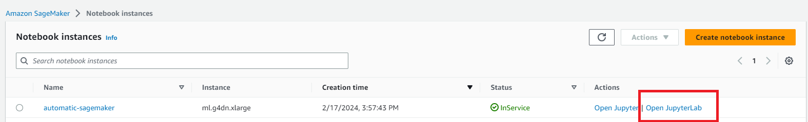
- Select the notebook instance where you want to create a new Python environment.
- We once the notebook is open click on File > New > Terminal
  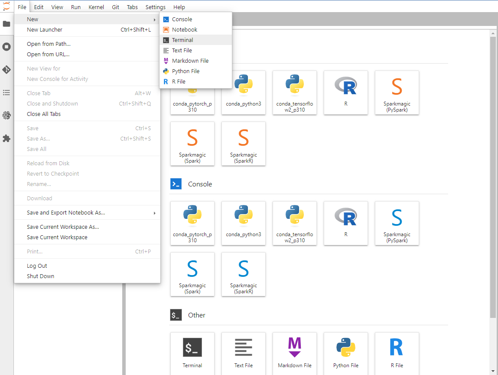

Step 2. Environment Installation 
To see the pre-built Conda environment, run either of the following commands in the notebook instance terminal:
```
$ conda env list
```
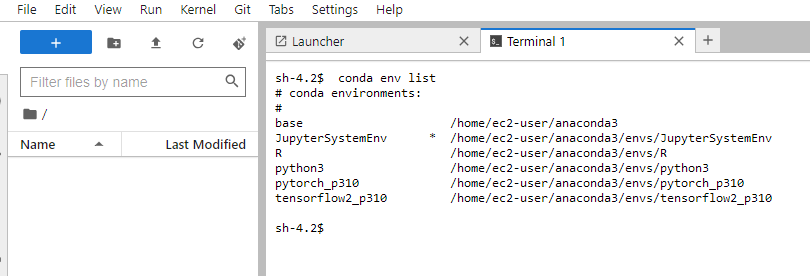
We are going to install a new our custom environment.
```plaintext
conda create --prefix /home/ec2-user/SageMaker/envs/automatic python=3.10.11 -y
```
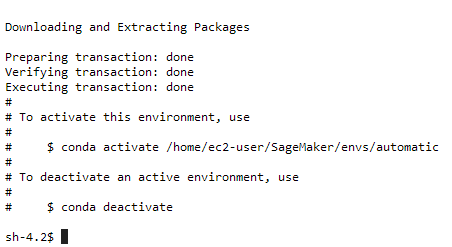

To install the Python packages in the correct Conda environment, first activate the environment before running **pip install** or **conda install** from the terminal.
Then we 
```
source activate /home/ec2-user/SageMaker/envs/automatic
```
usually is convenient having the latest pip
```
python -m pip install --upgrade pip
```
Note, due to in SageMaker notebook it is already installed Jupyter Notebook we skip install the ipykernel 

## Step 3 . Setup libraries
Once we have our running environment we install our kernel
and we create a new notebook, clicking File>New>Notebook
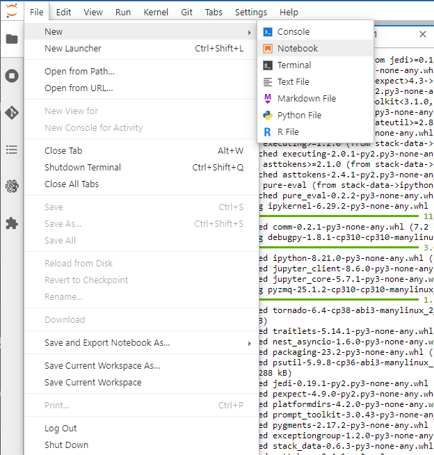
and then we choose our environment Just created as before `Python (Automatic)`
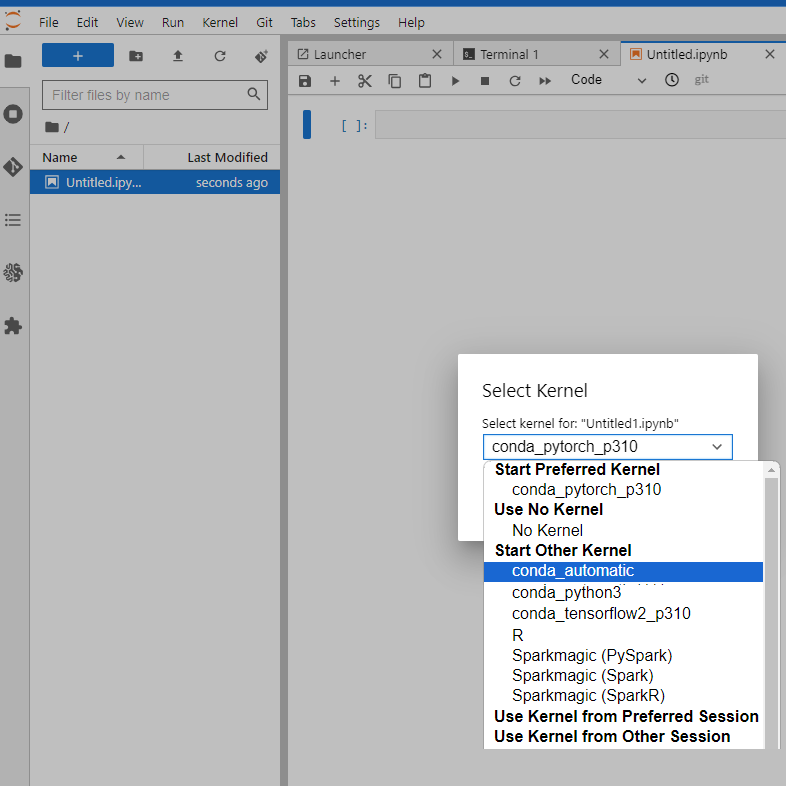
# Getting API Keys for Download Models

Some model authors require users to be logged in to download their model. It has happened for some models like this [model](https://civitai.com/models/191977).

## Steps to get API Key from Hugging Face

1. Go to https://huggingface.co/.
2. Log in and click on your profile on the top right and select Settings
   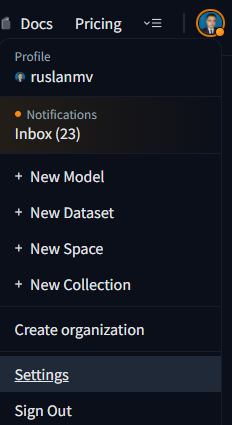
3. Scroll to Access Tokens, click create and copy
   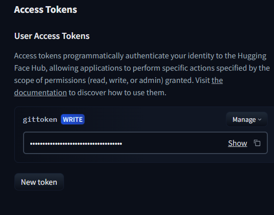
## Steps to get API Key from civitai.com
1. Go to https://civitai.com/
2. Log in and click on your profile on the top right.

3. Click on account settings.
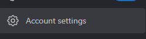
4. Scroll to API Key section.
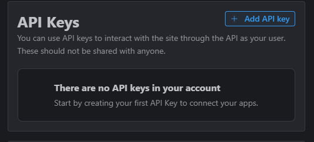
5. Click the **Add API key** button.
[](https://github.com/OwenTruong/civitdl/blob/master/doc/images/api_key/3-1-add-api-key-button.png)
6. Enter the name `civitdl` for the API key name.
[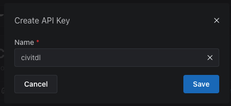](https://github.com/OwenTruong/civitdl/blob/master/doc/images/api_key/4-create-civitdl-key.png)
7. Copy your API key and save it somewhere.
[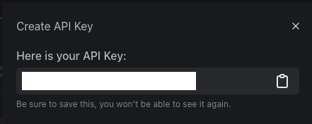](https://github.com/OwenTruong/civitdl/blob/master/doc/images/api_key/5-save-your-api-key.png)
8. After saving your key somewhere and refreshing the page, you should see `civitdl` listed as one of your API keys.
[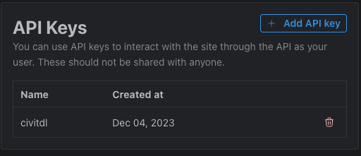](https://github.com/OwenTruong/civitdl/blob/master/doc/images/api_key/6-aftermath.png)

## Creation of .env file
 To create a `.env` file in the SageMaker terminal and paste the tokens and API key using the `vim` editor do the following:
1. Open the terminal in the SageMaker environment.
   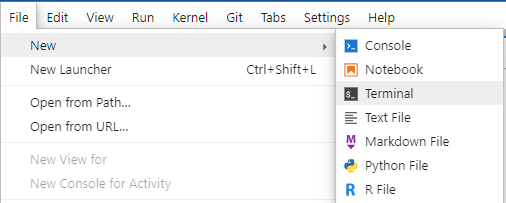
2. Navigate to  your root directory `/home/ec2-user/SageMaker`  where  we create the `.env` file. You can use the `cd` command to change directories if needed.
3. Create the `.env` file using the `vi` editor:
```
vi .env
```
This command opens the `vi` editor with a new file named `.env`.
4. Press the `i` key to enter the insert mode in `vi` editor. This allows you to start entering text.
5. Paste the tokens and API key into the file. Your file should look like this:
```
HF_TOKEN=<PASTE HERE>
API_KEY=<PASTE HERE>
```
Replace `<PASTE HERE>` with the actual values of your tokens and API key.

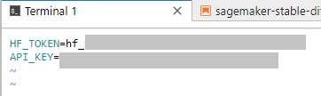
6. Press the `Esc` key to exit insert mode.
7. Save the changes and exit `vi` editor by typing `:wq` and then pressing `Enter`.
Now you have successfully created the `.env` file and pasted the tokens and API key using the `vim` editor in the SageMaker terminal.

### Load the notebook

In the terminal type
```
wget https://raw.githubusercontent.com/ruslanmv/Stable-Diffusion-Automatic-on-SageMaker-Notebook/master/sagemaker-stable-diffusion.ipynb

```

then 


### **Saving the environment on Amazon SageMaker EBS**

If you want to save your environment in S3 you can add the permitions to your 

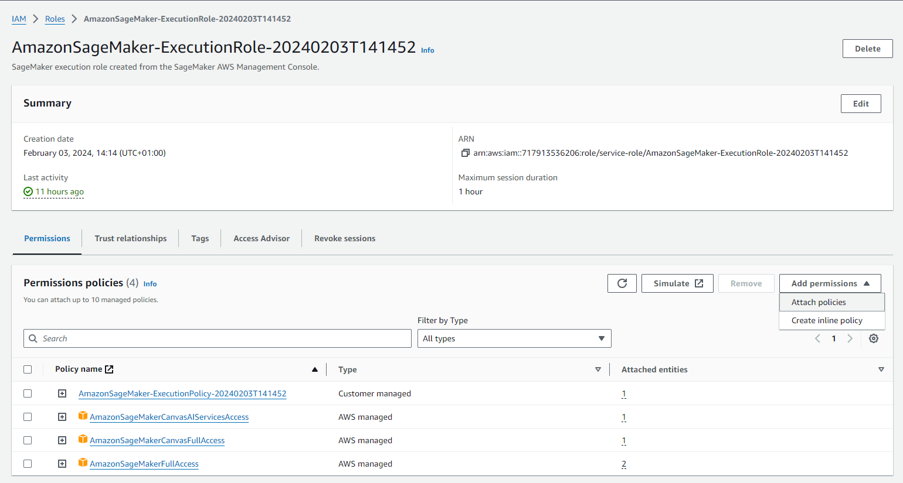
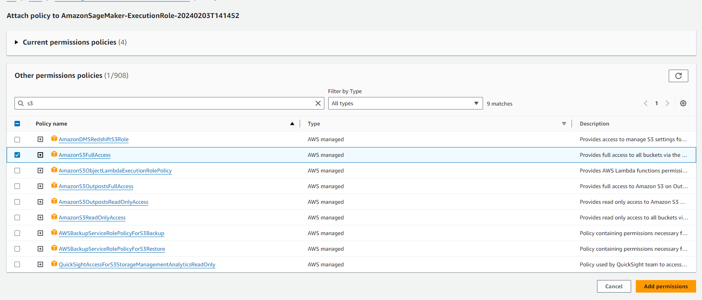
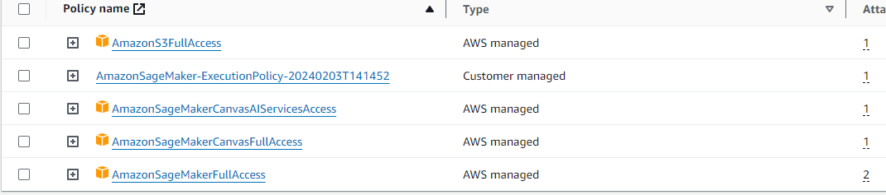

Then return back to your JupyterLab, to save the environment on the instance’s EBS storage by cloning the environment. You can run the following script in the Amazon Sagemaker Jupyter bash terminal:

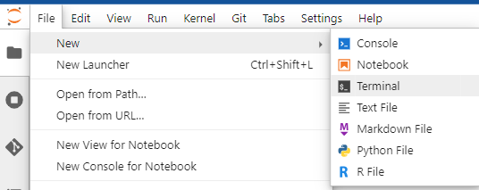

```
zip -r ~/SageMaker/automatic.zip ~/SageMaker/envs/

```

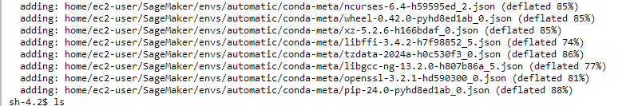

Then we can create a bucket in S3. 

You can setup the AWS CLI by typing

```
aws configure
```

with our credentials

```
AWS Access Key ID [None]: A****X
AWS Secret Access Key [None]: t****jh
Default region name [us-east-1]: 
Default output format [None]: 
```

Then we can create an AWS S3 bucket named for example `env-automatic` by using the AWS CLI. You can name like you like. Then  you can execute the following command:

```
aws s3api create-bucket --bucket env-automatic
```

then

```
aws s3 cp ~/SageMaker/automatic.zip s3://env-automatic/
```

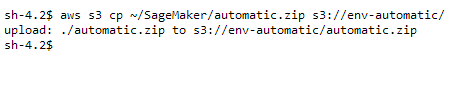

### Lifecycle configuration to create new instances  environment

To create a new instance and use the custom environment in that instance, you need to bring the .zip environment from Amazon S3 to the instance. You can do this automatically on the Amazon SageMaker console with the lifecycle configuration script. This script downloads the .zip file from Amazon S3 to the `/SageMaker/` folder on the instance’s EBS unzips the file, recreates the `/envs/` folder, and removes the redundant folders.

1. On the Amazon SageMaker console, under **Admin Configuration,** choose **Lifecycle Configurations (Notebook Instance).**

   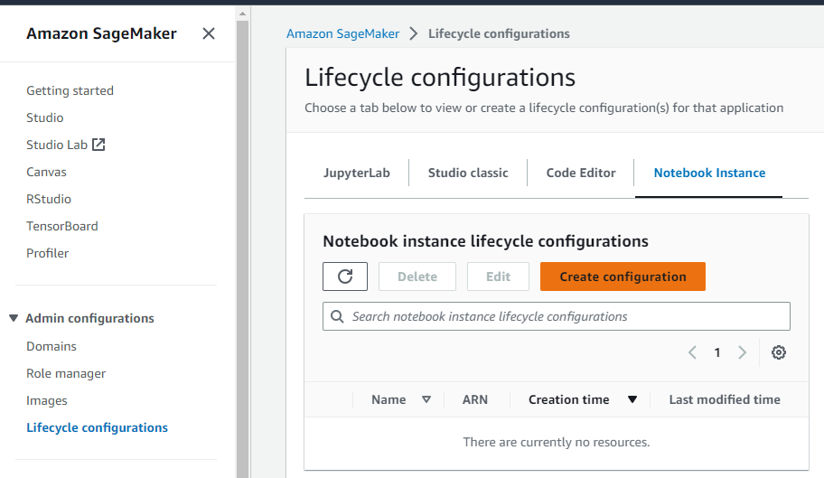

2. Select **Create Configuration**

3. Name it `automatic-env`.

On the **Create notebook** tab, enter the following script

> For Start Notebook

```plaintext
## On-Start: After you set up the environment in the instance
## then you can have this life-cycle config to link the custom env with kernel
#!/bin/bash    
sudo -u ec2-user -i <<'EOF'    
ln -s /home/ec2-user/SageMaker/envs/automatic /home/ec2-user/anaconda3/envs/automatic
EOF
echo "Restarting the Jupyter server..."
sudo systemctl restart jupyter-server
```
> For Create Notebook


To create the notebook unfortunatelly the runtime to load this enviroment automatic takes more than 5 minutes so we cannot 
automatiize.

So what we can do is once you are on the  new notebook 
you simple can  create script called `create_env.sh` and put this

```
aws s3 cp s3://env-automatic/automatic.zip ~/SageMaker/
unzip ~/SageMaker/automatic.zip -d ~/SageMaker/
mv ~/SageMaker/home/ec2-user/SageMaker/envs/ ~/SageMaker/envs
rm -rf ~/SageMaker/home/
rm ~/SageMaker/automatic.zip
```
then in the terminal type

```
sh create_env.sh
```